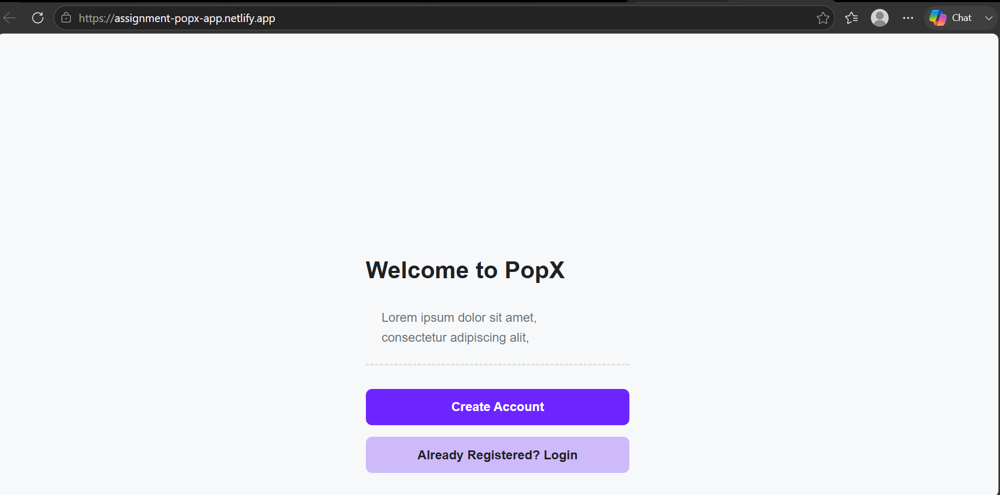
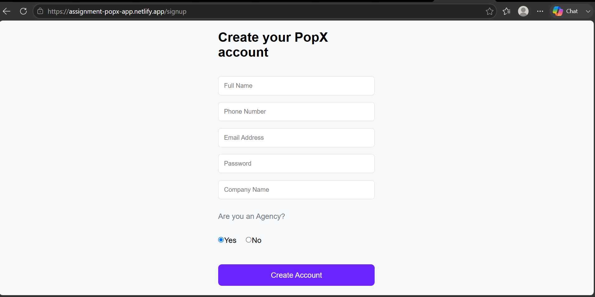
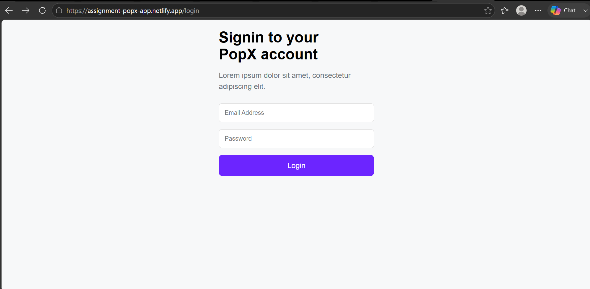
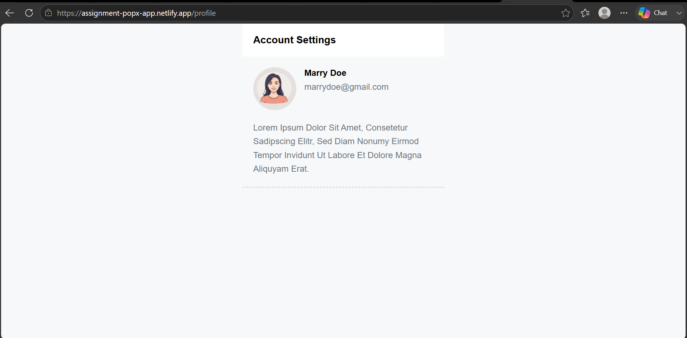

## PopX

A modern mobile-first React application featuring user registration, login, and profile management with a clean and responsive interface.

## Features

* Landing Page
* User Registration
* User Login
* Profile Page
* Responsive Design
* React Router Navigation
* Local Storage Integration

## Tech Stack

* React.js
* JavaScript
* CSS3
* Vite

## Run Locally

* npm install
* npm run dev

## Live Demo

https://assignment-popx-app.netlify.app/

## Screenshots

* Landing Page

* Create Account

* Login Page

* Account

